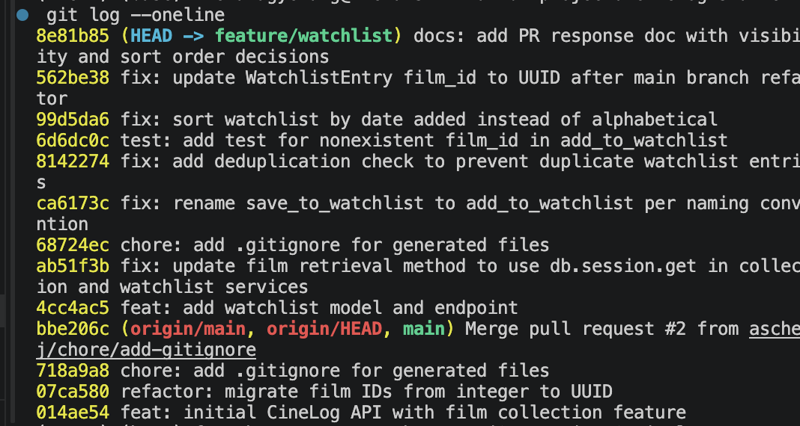

# PR Response Doc — CineLog Watchlist Feature

## AI Usage
I used Claude throughout this project, primarily for code review, debugging, and stress-testing my design reasoning — not for writing the substantive logic or design arguments themselves.

- **Code review, not code writing:** For Comments 1–3 and 6, I wrote the actual code myself (the dedup check, the test, the model fix), then had Claude review my diffs against the equivalent pattern in `collection_service.py`/`test_collection.py`. It caught a typo in my duplicate-entry error message, an incorrect type for a fake test ID, and a typo'd import (`WatchlistEntryEntry`) — all things I fixed myself after they were flagged.
- **Design pushback (Comments 4 and 5):** I asked Claude not to write my position on default visibility or sort orde. Instead, once I gave it my actual position, it played devil's advocate. For Comment 4, it pushed back that "the app should only focus on watched/reviewed content" didn't explain why the `public` field exists at all — that pushed me to reframe my argument around what a watchlist *represents* (an unreviewed intention) versus what a collection represents (a finished opinion). For Comment 5, it asked whether I had any evidence beyond "users like recency," which led me to notice that `get_collection()` already sorts newest-first — a concrete consistency argument I hadn't originally considered, which I then used as the core of my "Engagement with reviewer's point" section.
- **Debugging environment/git issues:** Used it to diagnose a `pip`/venv mismatch causing `No module named flask` (fixed by using `python -m pytest`), and to walk through Vim keystrokes during the interactive rebase (`cw`/`:wq`) and resolving the `.gitignore` add/add conflict during `git rebase origin/main`.
- **Catching a broken rebase:** After `git rebase origin/main` reported success, Claude flagged that `WatchlistEntry` had actually been silently dropped from `models.py` during the rebase (not a real conflict resolution — a silent patch failure), which I then fixed by hand by re-adding the model with the correct UUID-typed `film_id`.

## Comment 1 — Rename
**What I did:** Renamed `save_to_watchlist()` to `add_to_watchlist()` in `services/watchlist_service.py` to match the project's `verb_to_noun` naming convention used by `add_to_collection()`. Updated the one call site in `routes/watchlist/watchlist.py` (the `POST /<user_id>/add` route) along with its import statement.
**How I verified:** Used VS Code's project-wide search (Cmd+Shift+F) for `save_to_watchlist` across the whole repo to confirm no other file still referenced the old name — no results outside the two files I already updated. Also ran `pytest tests/ -v` after the change to confirm nothing else broke.

## Comment 2 — Deduplication
**What I did:** Added an `AlreadyInWatchlistError` exception and a duplicate check in `add_to_watchlist()`, modeled directly on `add_to_collection()` in `services/collection_service.py`: after confirming the film exists, it queries `WatchlistEntry` for an existing `(user_id, film_id)` row and raises the new exception if one is found, before creating the entry. I also added a `try/except` in `routes/watchlist/watchlist.py`'s `add_film` route (matching `routes/collection.py`'s pattern) so the new exception returns a 409 instead of crashing into a 500 — the route previously had no error handling at all, even for the existing `FilmNotFoundError`.
**How I verified:** Ran `pytest tests/ -v` after the change to confirm the existing suite still passes.

## Comment 3 — Missing test
**What I did:** Created `tests/test_watchlist.py` with `test_add_to_watchlist_nonexistent_film_raises`, modeled on `test_add_to_collection_nonexistent_film_raises` in `tests/test_collection.py` — same fixture structure (`app`, `sample_user`), same assertion pattern (`pytest.raises(FilmNotFoundError)`). One difference from the collection version: since this branch's `Film.id` is still an `Integer` (pre-UUID-refactor), the fake ID is a nonexistent int (`999999`) rather than a UUID string.
**How I verified:** Ran `python -m pytest tests/test_watchlist.py -v` and the full `python -m pytest tests/ -v` — all tests pass.

## Comment 4 — Default visibility
**My position:** Watchlist entries should default to public=False. Users who want to share what they plan to watch can explicitly set public=True. I chose to keep the public field because there is value in allowing users to share upcoming movies, but that should be an intentional opt-in rather than the default behavior.

**Reasoning:** CineLog describes itself as a community film-tracking app where users discover movies through other people's reviews and ratings. That value comes from completed experiences—films people have actually watched and formed opinions about. A watchlist is different: it only represents an intention to watch a movie, not a review or recommendation. Since the platform's discovery experience is centered on watched and rated films, making watchlists public by default exposes information that is less meaningful to the community.

**Tradeoff acknowledged:** A public-by-default watchlist could encourage social discovery by letting friends see what someone is planning to watch, similar to Goodreads' "Want to Read" shelf. That is a valid design choice for platforms with features built around following friends and sharing future interests. However, CineLog's current community features focus on collections, reviews, and ratings—not watchlists. Because there is no dedicated social experience built around watchlists, the benefit of making them public by default is speculative. A private default better matches user expectations for a personal "want to watch" list while still allowing anyone who wants to share it to opt in.

## Comment 5 — Sort order
**My position:** I agree that watchlists should sort by date added (newest first), not alphabetically. I changed `get_watchlist()` to order by `WatchlistEntry.date_added.desc()` instead of `Film.title.asc()`.

**Reasoning:** When users open their watchlist, they're most likely looking for the movie they recently added, the one they just discovered or decided to watch. Showing the newest entries first makes those films immediately accessible. Alphabetical sorting, on the other hand, can bury recently added movies simply because of their title.

**Engagement with reviewer's point:** This change also keeps the experience consistent across CineLog. The existing get_collection() method in services/collection_service.py already sorts films by CollectionEntry.date_added.desc(), so users are accustomed to seeing their lists ordered by when items were added. Keeping the watchlist alphabetical would introduce a different sorting behavior for a similar type of list, making the interface less predictable. Using the same newest-first ordering across both views creates a more consistent and intuitive user experience.

## Comment 6 — Rebase
**What conflicted:** Running `git fetch origin` + `git rebase origin/main` hit an add/add conflict on `.gitignore` first (both branches had independently added one), resolved by keeping the union of both sets of ignore patterns. After that, the rebase reported success with no further conflicts — but this was misleading: the patch that added the `WatchlistEntry` model silently failed to reapply during the rebase, leaving `models.py` missing the class entirely while `services/watchlist_service.py` and `tests/test_watchlist.py` still imported it, causing an ImportError on test collection. The real conflict — `WatchlistEntry.film_id` still needing to be a UUID string instead of an `Integer`, per the maintainer's comment — had to be resolved by hand rather than by git.
**How I resolved it:** Re-added the `WatchlistEntry` class to `models.py`, in the same position (after `CollectionEntry`), with `film_id` typed as `db.Column(db.String(36), db.ForeignKey("film.id"), nullable=False)` instead of the original `db.Integer`, matching how `CollectionEntry.film_id` was already updated by the refactor. Also corrected a stale docstring in `add_to_watchlist()` that still described `film_id` as an integer.
**How I verified no conflict remains:** Ran `pytest tests/ -v` — all tests pass, confirming the `WatchlistEntry` import resolves correctly and the UUID-typed foreign key works end to end.

## Commit History

`git log --oneline` on `feature/watchlist`, showing conventional commits and no merge commits:



## PR Description
### What this feature does
Adds a watchlist to CineLog so users can save films they want to watch later, separate from their collection of films they've already watched and rated. It introduces a `WatchlistEntry` model, `add_to_watchlist(user_id, film_id)` and `get_watchlist(user_id)` service functions, and two endpoints: `GET /watchlist/<user_id>` to view a user's watchlist, and `POST /watchlist/<user_id>/add` to add a film to it. Adding a film that's already on the watchlist returns a `409` instead of creating a duplicate, and adding a film that doesn't exist returns a `404`.

### Design decisions
- **Default visibility:** Watchlist entries default to `public=False`. CineLog's core value is discovery through completed, rated opinions (like Rotten Tomatoes), not through unreviewed intentions to watch something — so watchlists stay private unless a user explicitly opts in to share them.
- **Sort order:** `get_watchlist()` returns entries newest-first (`date_added` descending) rather than alphabetically, both because users most want to see what they just added, and for consistency with `get_collection()`, which already sorts the same way.

### How to manually test
1. Start the app: `python app.py` (runs on `http://127.0.0.1:5000`).
2. Since there's no user/film creation endpoint, seed a test user and film directly with a quick script:
   ```bash
   python -c "
   from app import create_app, db
   from models import User, Film
   app = create_app()
   with app.app_context():
       user = User(username='testuser', email='test@example.com')
       film = Film(title='Paddington 2', year=2017, genre='Comedy')
       db.session.add_all([user, film])
       db.session.commit()
       print('user_id:', user.id)
       print('film_id:', film.id)
   "
   ```
3. Add the film to the watchlist (replace `<user_id>`/`<film_id>` with the values printed above):
   ```bash
   curl -X POST http://127.0.0.1:5000/watchlist/<user_id>/add \
     -H "Content-Type: application/json" \
     -d '{"film_id": "<film_id>"}'
   ```
   Expect a `201` with the new entry, including `"public": false`.
4. View the watchlist: `curl http://127.0.0.1:5000/watchlist/<user_id>` — confirm the film appears with `date_added` and `public: false`.
5. Try adding the same film again with the same `curl` command from step 3 — expect a `409` with an "already in this user's watchlist" error, not a duplicate entry.
6. Try adding a nonexistent film ID (e.g. `"film_id": "00000000-0000-0000-0000-000000000000"`) — expect a `404` with a "no film found" error.
7. Add a second film and confirm `GET /watchlist/<user_id>` returns it before the first (newest-added-first ordering).